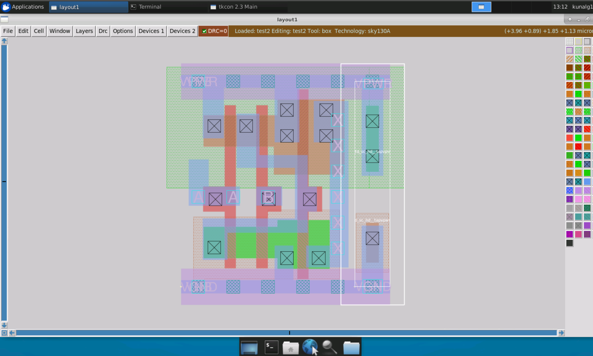
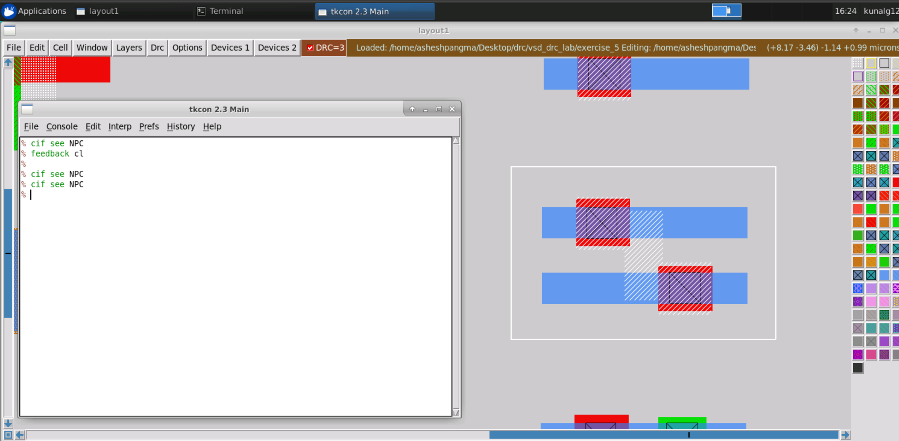

# Physical Verification Using SKY130

This repository contains all the steps performed in 5-day Physical Verification Using SKY130 workshop. In this workshop, we primarily focus in the process of Physical verification like DRC(Design Rule Check) and LVS(Layout vs Schematic) check using sky130 PDK. All the lab exercises are performed in VSD online platform. 

# Table of Contents

- [Day 1 - Introduction to Skywater SKY130](#day-1---introduction-to-skywater-sky130)
  * [Introduction](#introduction)
  * [Software Tools and Setup](#software-tools-and-setup)
  * [DRC and LVS Overview](#drc-and-lvs-overview)
- [Day 2 Introduction to DRC and LVS](#day-2-introduction-to-drc-and-lvs)
  * [GDS](#gds)
  * [Basic Extraction](#basic-extraction)
  * [DRC, LVS and XOR](#drc-,-lvs-and-xor)
- [Day 3 Front-end and Back-end DRC](#day-3-front---end-and-back---end-drc)
  * [DRC Rules](#drc-rules)
    * [Width Rule and Spacing Rule](#width-rule-and-spacing-rule)
    * [Wide Spacing Rule and Notch Rule](#wide-spacing-rule-and-notch-rule)
    * [Vias](#vias)
    * [Minimum Area Rule and Minimum Hole Rule](#minimum-area-rule-and-minimum-hole-rule)
    * [Wells and Deep N-well](#wells-and-deep-N---well)
    * [Derived Layers](#derived-layers)
    * [Paramaterized and PDK devices](#paramaterized-and-pdk-devices)
    * [Angle Error and Overlap Rule](#angle-error-and-overlap-rule)
    * [Unimplemented Rules](#unimplemented-rules)
    * [Latch-up and antenna Rule](#latch---up-and-antenna-rule)
    * [Density Rules](#density-rules)
- [Day 4 Understanding PNR and Physical Verification](#day-4-understanding-pnr-and-physical-verification)
  * [OpenLANE Flow](#openlane-flow)
- [Day 5  Running Layout vs Schematic](#day-5--running-layout-vs-schematic)
  * [Simple LVS Experiment](#simple-lvs-experiment)
  * [LVS Layout vs Verilog for Standard Cell](#lvs-layout-vs-verilog-for-standard-cell)
  * [LVS for Small Analog Block Power on Reset](#lvs-for-small-analog-block-power-on-reset)
  * [LVS Digital PLL](#lvs-digital-pll)
- [References](#references)
- [Acknowledgement](#acknowledgement)

# Day 1 - Introduction to Skywater SKY130

## Introduction

## Software Tools and Setup

  

  

  

  

  

  

  

  

  

  

  

  

  

  

  

  

  

## DRC and LVS Overview

# Day 2 Introduction to DRC and LVS

## GDS

## Basic Extraction

## DRC, LVS and XOR

# Day 3 Front-end and Back-end DRC

## DRC Rules

### Width Rule and Spacing Rule

### Wide Spacing Rule and Notch Rule

### Vias

### Minimum Area Rule and Minimum Hole Rule

### Wells and Deep N-well

### Derived Layers

### Paramaterized and PDK devices

### Angle Error and Overlap Rule

### Unimplemented Rules

### Latch-up and antenna Rule

### Density Rules

# Day 4 Understanding PNR and Physical Verification
## OpenLANE Flow

# Day 5  Final steps for RTL2GDS
## Simple LVS Experiment
##

# References

* VLSI System Design: https://www.vlsisystemdesign.com/
* OpenLANE: https://github.com/The-OpenROAD-Project/OpenLane

# Acknowledgement

* Kunal Ghosh, Co-founder, VSD Corp. Pvt. Ltd.
* Timothy Edwards, Founder Opencircuitdesign.com and SVP at Efabless.
* Google
