# Physical Verification Using SKY130

This repository contains all the steps performed in 5-day Physical Verification Using SKY130 workshop. In this workshop, we primarily focus in the process of Physical verification like DRC(Design Rule Check) and LVS(Layout vs Schematic) check using sky130 PDK. All the lab exercises are performed in VSD online platform. 

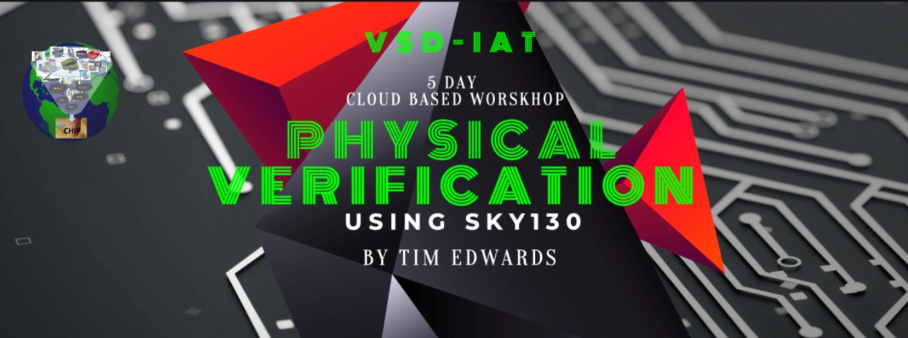


# Table of Contents

- [Day 1 - Introduction to Skywater SKY130](#day-1---introduction-to-skywater-sky130)
  * [Introduction](#introduction)
  * [Software Tools and Setup](#software-tools-and-setup)
  * [DRC and LVS Overview](#drc-and-lvs-overview)
- [Day 2 Introduction to DRC and LVS](#day-2-introduction-to-drc-and-lvs)
  * [GDS](#gds)
  * [Basic Extraction](#basic-extraction)
  * [DRC, LVS and XOR](#drc-,-lvs-and-xor)
- [Day 3 Front-end and Back-end DRC](#day-3-front---end-and-back---end-drc)
  * [DRC Rules](#drc-rules)
    * [Width Rule and Spacing Rule](#width-rule-and-spacing-rule)
    * [Wide Spacing Rule and Notch Rule](#wide-spacing-rule-and-notch-rule)
    * [Vias](#vias)
    * [Minimum Area Rule and Minimum Hole Rule](#minimum-area-rule-and-minimum-hole-rule)
    * [Wells and Deep N-well](#wells-and-deep-N---well)
    * [Derived Layers](#derived-layers)
    * [Paramaterized and PDK devices](#paramaterized-and-pdk-devices)
    * [Angle Error and Overlap Rule](#angle-error-and-overlap-rule)
    * [Unimplemented Rules](#unimplemented-rules)
    * [Latch-up and antenna Rule](#latch---up-and-antenna-rule)
    * [Density Rules](#density-rules)
- [Day 4 Understanding PNR and Physical Verification](#day-4-understanding-pnr-and-physical-verification)
  * [OpenLANE Flow](#openlane-flow)
- [Day 5  Running Layout vs Schematic](#day-5--running-layout-vs-schematic)
  * [Simple LVS Experiment](#simple-lvs-experiment)
  * [LVS Layout vs Verilog for Standard Cell](#lvs-layout-vs-verilog-for-standard-cell)
  * [LVS for Small Analog Block Power on Reset](#lvs-for-small-analog-block-power-on-reset)
  * [LVS Digital PLL](#lvs-digital-pll)
- [References](#references)
- [Acknowledgement](#acknowledgement)

# Day 1 - Introduction to Skywater SKY130

## Introduction

SKY130 is an open source PDK(Process Design Kit) provided by Skywater foundry and Google to design Ic that are opensource. This mean the IPs can be used by anyone without any charge. The main focus is to develop efficient and optimized IC for better performance.
The following git repository holds all the information about sky130 PDK.
https://github.com/google/skywater-pdk


## Software Tools and Setup

### Magic

To install Magic, do the following steps:
```
git clone git://opencircuitdesign.com/magic
cd magic
./configure
make
sudo make install
```

To run magic, go to mag directory and type `magic` in the prompt.


### Netgen
To run Negten, go to netgen directory and type `netgen` in the prompt.


### Xschem
To run xschem, go to xschem directory and type `xschem` in the prompt.
Xschem Prompt |  Xschem Prompt Linked
:-------------------------:|:-------------------------:
  |  
To enter deep in ths block, select the block and press `e`. To return to top level press `ctrl + e`.

### Ngspice
To run Ngspice, go to ngspice directory and type `ngspice` in the prompt.

 
### Magic Basics 
Magic Basics |  Nfet
:-------------------------:|:-------------------------:
 |  


  
### DRC and LVS Overview with Inverter
Inverter Schematic |  Inverter Symbol
:-------------------------:|:-------------------------:
 |    


Inverter Layout Cells |  Extraction from Inverter in Magic
:-------------------------:|:-------------------------:
 |   


We run LVS using Netgen and the result is shown below:

Running Netgen |  LVS Result
:-------------------------:|:-------------------------:
 |  

  

Extraction from Inverter in Magic |  Spice File
:-------------------------:|:-------------------------:
 |  
  

  


# Day 2 Introduction to DRC and LVS

## GDS
CIF ISTYLE |  Loading AND Gate
:-------------------------:|:-------------------------:
 |  


Changing CIF Style |  Loading AND Gate with Sky130() CIF Style
:-------------------------:|:-------------------------:
 |  


Spice File location |  AND Gate Spice File
:-------------------------:|:-------------------------:
 |  


Lef Read |  Ports
:-------------------------:|:-------------------------:
 |  

## Abstract Views
Open new Magic prompt and do lef read and load AND gate and expand it.

Lef Read |  Ports
:-------------------------:|:-------------------------:
 |  

Load Test Instance |  GDS Write test
:-------------------------:|:-------------------------:
 |  


GDS read Test |  Layout of Test
:-------------------------:|:-------------------------:
 |  


When we load the test, we get the following layout for AND gate. The AND gate is actually loaded from sky130_fd_sc_hd/gds directory.
GDS read Test |  Layout of Test
:-------------------------:|:-------------------------:
 |  

The sky130_fd_sc_hd__and2_1 cell is written to test file and edited and saved. When loading the test file the additional layer is not saved and the cell is loaded from the sky130_fd_sc_hd/gds directory.
GDS write Test |  GDS read Test
:-------------------------:|:-------------------------:
 |  


## Basic Extraction

Performing Extraction |  Location of Spice file
:-------------------------:|:-------------------------:
 |  

Spice File |  Spice File with Parasitic Capacitance
:-------------------------:|:-------------------------:
 |  


Extraction Label |  Extraction with Parasitic Resistance
:-------------------------:|:-------------------------:
 |  


Extraction with threshold value |  Spice File
:-------------------------:|:-------------------------:
 |  


## DRC, LVS and XOR

DRC mode |  DRC check
:-------------------------:|:-------------------------:
 |  

DRC Error  |  DRC Error Correction
:-------------------------:|:-------------------------:
 |  

LVS setup |  Extraction for LVS
:-------------------------:|:-------------------------:
 |  

LVS result |  XOR Result
:-------------------------:|:-------------------------:
 | 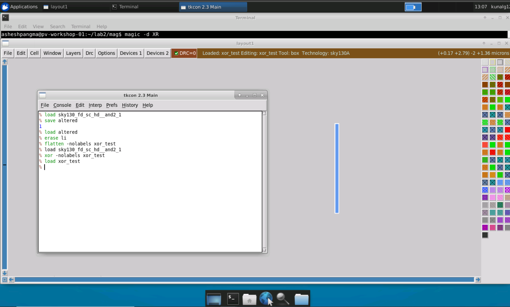


# Day 3 Front-end and Back-end DRC


## DRC Rules


### Width Rule, Spacing Rule, Wide Spacing Rule and Notch Rule

Clone Git Repository |  DRC Rule
:-------------------------:|:-------------------------:
 | 

### Vias

Via Overlap Rule |  Via Overlap Error Correction
:-------------------------:|:-------------------------:
 |  


### Minimum Area Rule and Minimum Hole Rule

Minimum Area Error |  Minimum Area Error Correction
:-------------------------:|:-------------------------:
 | 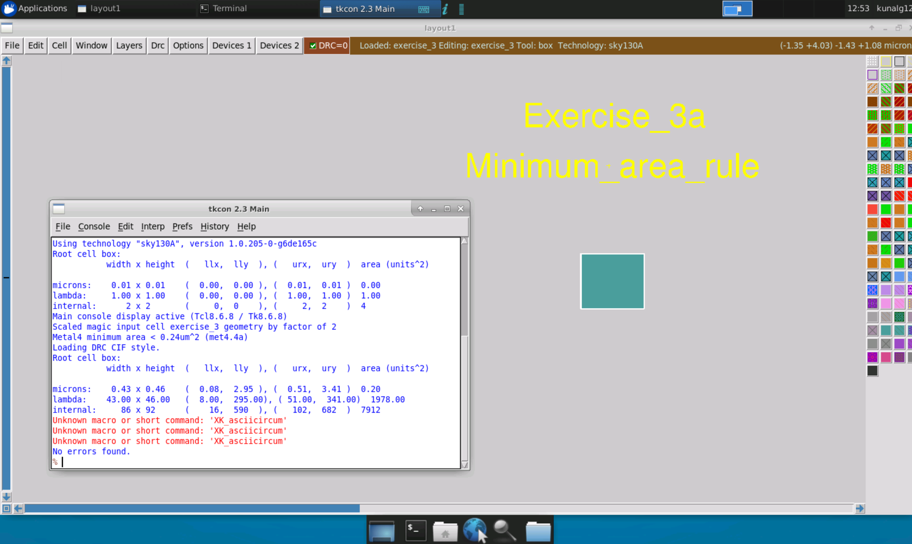

Minimim Hole Area |  Minimim Hole Area Error Correction
:-------------------------:|:-------------------------:
 | 

### Wells and Deep N-well

Nwell Error |  Nwell Error Correction
:-------------------------:|:-------------------------:
  | 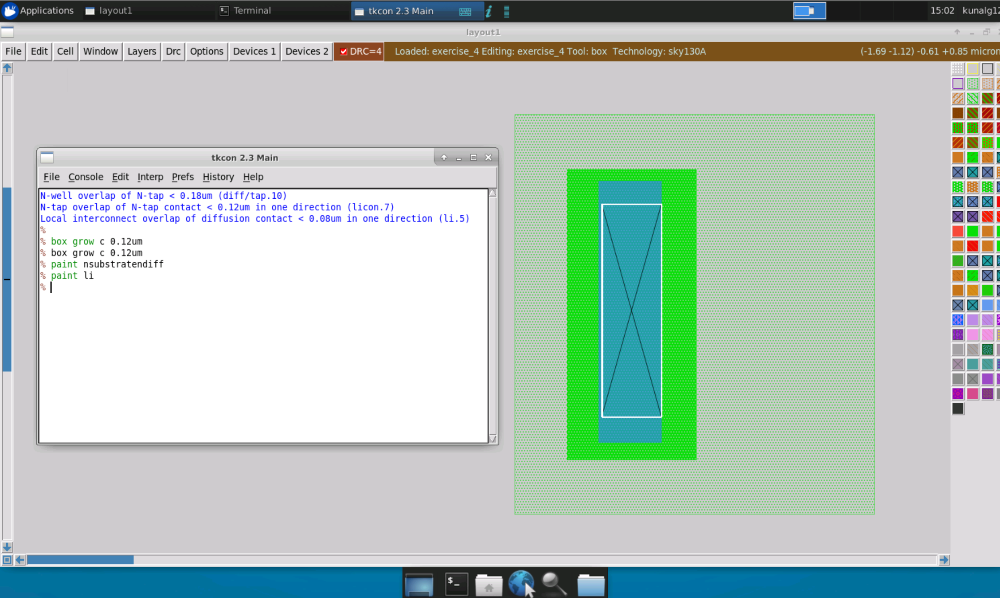

Pwell Error |  Pwell Error Correction
:-------------------------:|:-------------------------:
 | 

DeepNwell Error |  DeepNwell Error Correction
:-------------------------:|:-------------------------:
 | 


### Derived Layers

Derived Layer |  HVI Layer
:-------------------------:|:-------------------------:
 | 

Derived Layer Error |  NPC Layer
:-------------------------:|:-------------------------:
 | 

NPC Layer |  NPC Layer
:-------------------------:|:-------------------------:
 | 


### Paramaterized and PDK devices

Paramaterized Devices Error |  Paramaterized Devices Error Solution
:-------------------------:|:-------------------------:
 | 


### Angle Error and Overlap Rule


Angle Error |  Angle Error
:-------------------------:|:-------------------------:
 | 

Angle Error Correction |  Angle Error Correction
:-------------------------:|:-------------------------:
 | 

Overlap Error | 
:-------------------------:|:-------------------------:
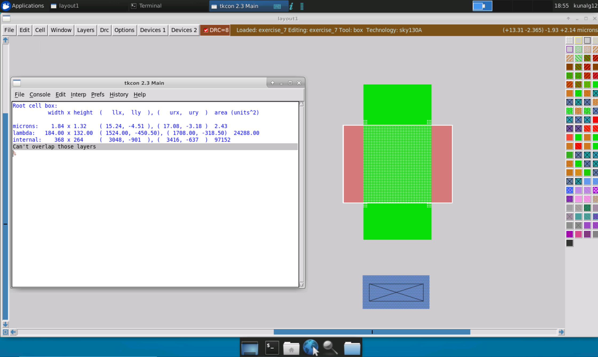 |


Overlap Rule |  Overlap Error Correction
:-------------------------:|:-------------------------:
 | 


### Unimplemented Rules

Latchup Rule Error |  Latchup Rule Error Correction
:-------------------------:|:-------------------------:
 | 


### Latch-up and antenna Rule

Antenna Rule Error |  Antenna Rule Error
:-------------------------:|:-------------------------:
 | 

Antenna Rule Error |  Antenna Rule Error Correction
:-------------------------:|:-------------------------:
 | 

Antenna Rule Error |
:-------------------------:|


### Density Rules

Density of Metal Layers |  Density Rule Error
:-------------------------:|:-------------------------:
 | 

Fill Pattern View |  Generated GDS File
:-------------------------:|:-------------------------:
 | 

Generated Fill Pattern |  Density of Different Metal Layers | Fill Pattern
:-------------------------:|:-------------------------:|:-------------------------:
 |  | 


# Day 4 Understanding PNR and Physical Verification
## OpenLANE Flow

# Day 5  Final steps for RTL2GDS

## Simple LVS Experiment


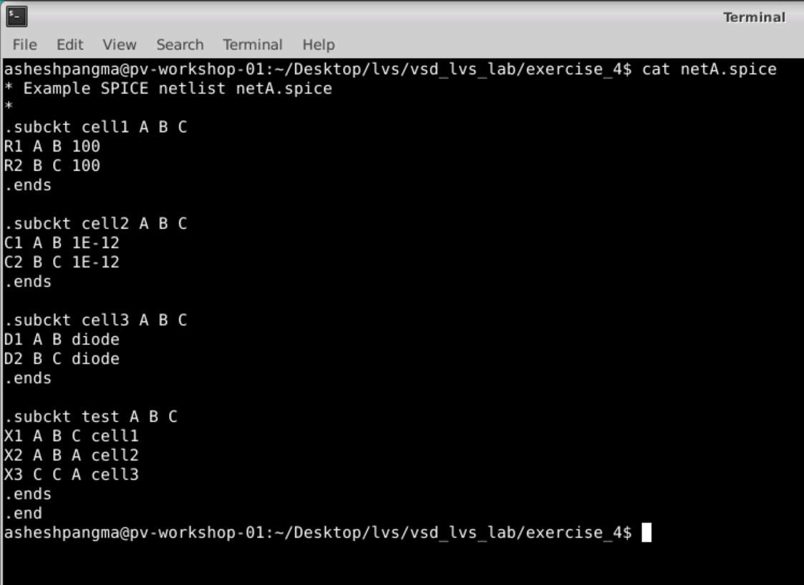


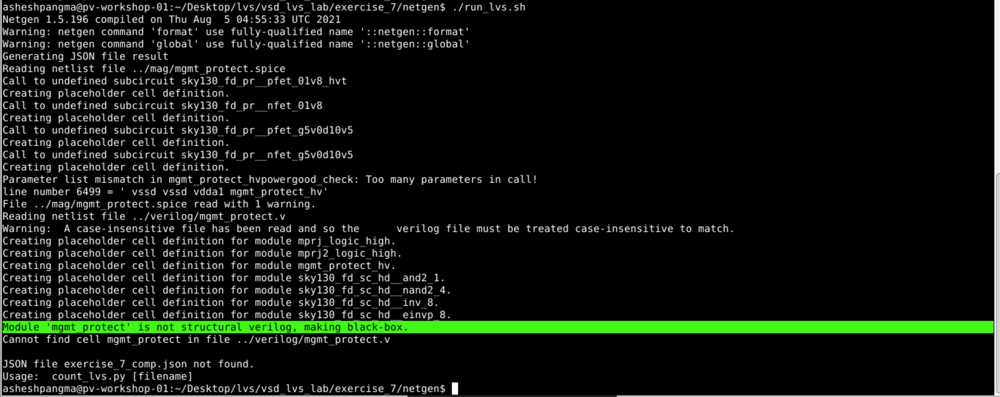
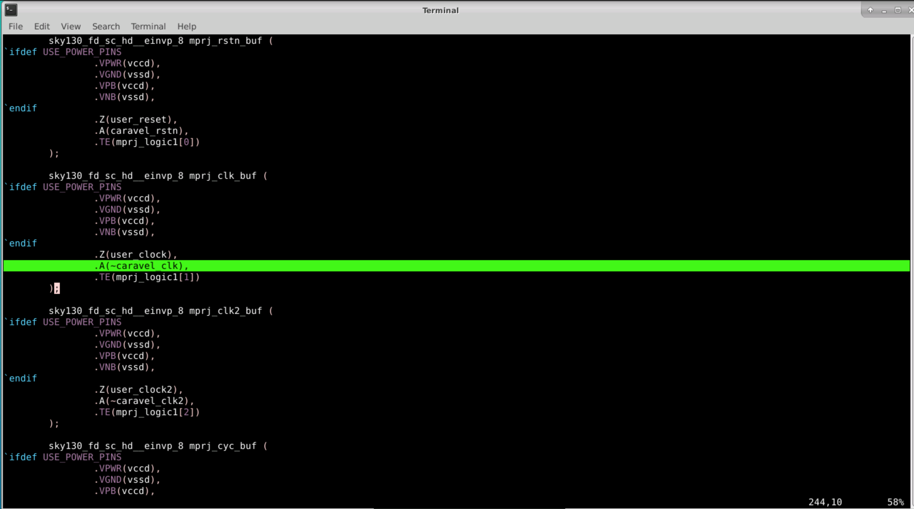


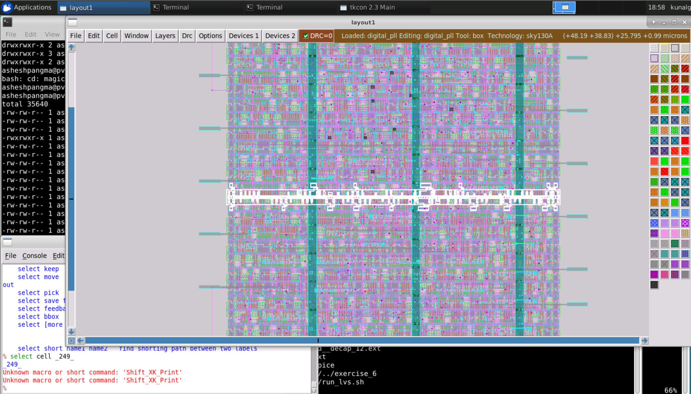


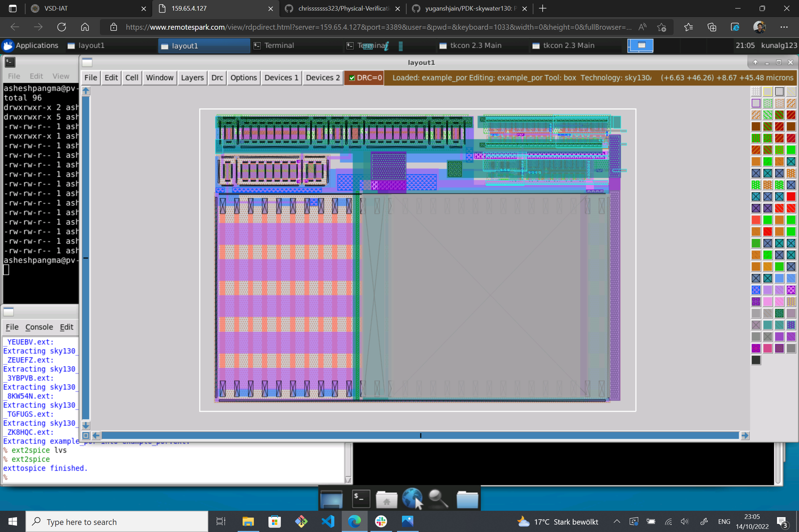


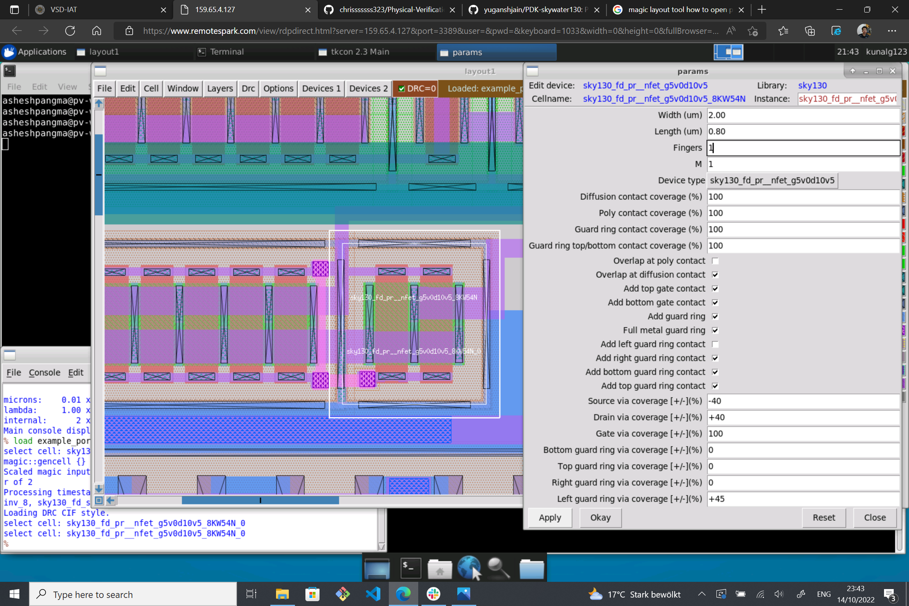


##

# References

* VLSI System Design: https://www.vlsisystemdesign.com/
* OpenLANE: https://github.com/The-OpenROAD-Project/OpenLane

# Acknowledgement

* Kunal Ghosh, Co-founder, VSD Corp. Pvt. Ltd.
* Timothy Edwards, Founder Opencircuitdesign.com and SVP at Efabless.
* Google
